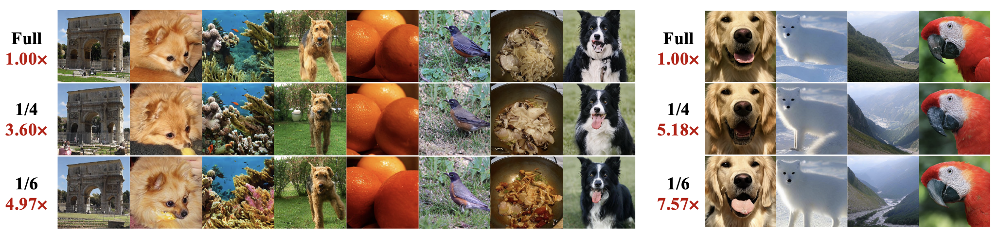
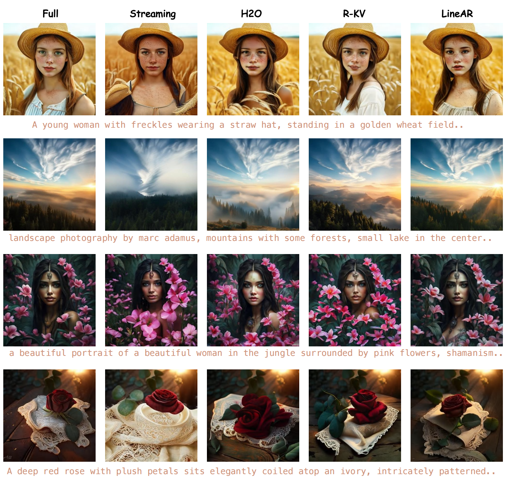
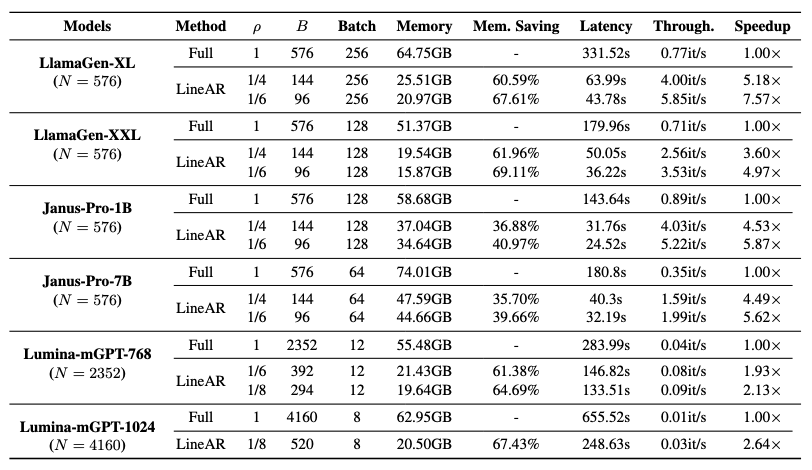

  
   

# Autoregressive Image Generation Needs Only a Few Lines of Cached Tokens

<!-- [Ziran Qin](https://github.com/Zr2223)1, Youru Lv1*, Mingbao Lin2, Zeren Zhang3,   Chaofan Gan1, Tieyuan Chen1, Weiyao Lin1* -->

<!-- 1Shanghai Jiao Tong University, 2Rakuten, 3Peking University -->

---

  
   
  <em>LineAR enables efficient autoregressive image generation, preserving only 1/8, 1/6, and 1/6 of the KV cache, achieving up to 2.13x, 5.62x, and 7.57x speedup on Lumina-mGPT, Janus-Pro, and LlamaGen models, with improved or comparable generation quality.</em>

## 📖 Abstract

>Autoregressive (AR) visual generation has emerged as a powerful paradigm for image and multimodal synthesis, owing to its scalability and generality. However, existing AR image generation suffers from severe memory bottlenecks due to the need to cache all previously generated visual tokens during decoding, leading to both high storage requirements and low throughput. In this paper, we introduce **LineAR**, a novel, training-free progressive key-value (KV) cache compression pipeline for autoregressive image generation. 
By fully exploiting the intrinsic characteristics of visual attention, LineAR manages the cache at the line level using a 2D view, preserving the visual dependency regions while progressively evicting less-informative tokens that are harmless for subsequent line generation, guided by inter-line attention. 
LineAR enables efficient autoregressive (AR) image generation by utilizing only a few lines of cache, achieving both memory savings and throughput speedup, while maintaining or even improving generation quality. Extensive experiments across six autoregressive image generation models, including class-conditional and text-to-image generation, validate its effectiveness and generality. LineAR improves ImageNet FID from 2.77 to 2.68 and COCO FID from 23.85 to 22.86 on LlamaGen-XL and Janus-Pro-1B, while retaining only 1/6 KV cache. It also improves DPG on Lumina-mGPT-768 with just 1/8 KV cache.
Additionally, LineAR achieves significant memory and throughput gains, including up to 67.61\% memory reduction and 7.57x speedup on LlamaGen-XL, and 39.66\% memory reduction and 5.62x speedup on Janus-Pro-7B.

🌟 If you find this project useful, please give it a star 🌟! Thank you!!

## 🔥 Highlights

1️⃣ **Lossless Quality: Maintains or even improves generation quality**

  
   
  <em> Text-to-image generation results on Lumina-mGPT-768 (left) and Janus-Pro-7B (right).</em>

  
   
  <em> Class-conditional image generation results on LlamaGen-XXL (left) and LlamaGen-XL (right).</em>

2️⃣ **Sota performance**

  
   
  <em> Comparison with other methods. LineAR shows the best generation quality.</em>

3️⃣ **Efficiency**

  
   
  <em> LineAR demonstrates high efficiency in memory saving and throughput speedup across different architectures, sizes, and generation resolutions.</em>

## 💡 Pipeline 

>LineAR introduces a **progressive KV cache compression pipeline** that manages the KV cache from a 2D perspective by dividing the image generation process into rasterized line stages. By fully leveraging the inherent locality and inter-line consistency in visual generation, LineAR progressively discards less informative tokens for the next line generation under **inter-line guidance**, while preserving the initial anchor tokens and recent lines to maintain global conditioning and local dependencies.

  
   
  <em>Overview of LineAR.</em>

---

## 📢 News
* **[2025-12-04]** ArXiv paper available. Code will be released soon!
